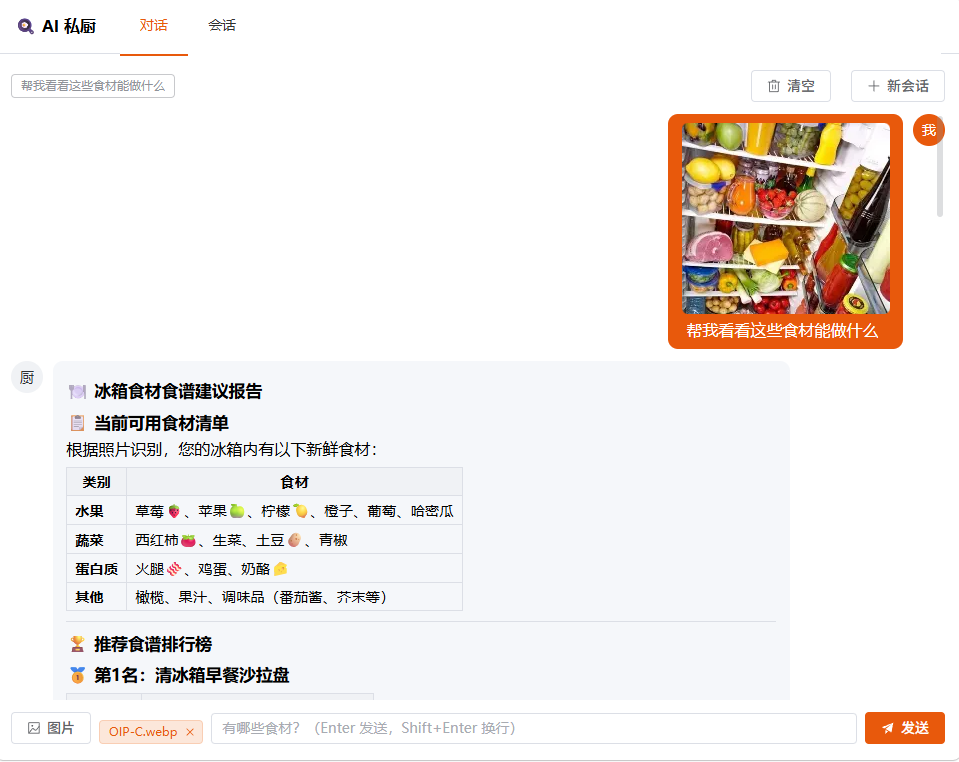

# AI 私厨

拍一张冰箱照片，或者直接报出食材，agent 联网搜菜谱 → 按营养和难度打分排序 → 给出带参考图的建议。



## 亮点

- **Agent 编排**：LangGraph `create_agent` 把 qwen 多模态模型和 Tavily 联网搜索串成一条链路，从食材照片识别一路走到带参考图的方案输出；系统提示词里约束了"搜索不到才允许自己发挥"。
- **多轮会话持久化**：用 LangGraph 的 `SqliteSaver` checkpoint 存会话状态，按 `thread_id` 一维定位，服务重启历史不丢，删一条记录即清空整个会话。
- **流式输出**：后端 `StreamingResponse` 边生成边吐文本，前端读 `res.body` 增量渲染。注意这**不是标准 SSE**，原因见文末「一些实现说明」。
- **图片不占后端带宽**：前端取 OSS 签名后直传，后端只负责签发；上传路径由服务端生成（`uploads/{uuid}.{ext}`），客户端传什么文件名都进不了最终 key。
- **单端口部署**：`npm run build` 直接产出到 `app/static`，FastAPI 一个进程同时托管 API 和前端页面，不用起两个服务。

## 技术栈

| 层 | 用了什么 |
|---|---|
| 后端 | FastAPI + LangGraph / LangChain |
| 模型 | qwen3.5-plus（多模态，走 DashScope 的 OpenAI 兼容接口） |
| 工具 | Tavily 联网搜菜谱 |
| 记忆 | LangGraph `SqliteSaver` checkpoint，存本地 SQLite |
| 图片 | 前端取 OSS 签名后直传，不经过后端 |
| 前端 | Vue 3 + Vite + TypeScript + Element Plus |

## 跑起来

### 1. 后端

```bash
uv sync
cp .env.example .env          # 然后填上自己的 key
.venv/Scripts/python.exe -m app.main        # Windows
# .venv/bin/python -m app.main              # Linux / macOS
```

服务在 <http://127.0.0.1:8001>。首次启动会自动建 `db/personal_chief.db`。

### 2. 前端（开发）

```bash
cd frontend
npm install
npm run dev        # http://localhost:5173，/api 自动代理到 8001
```

### 3. 前端（构建进后端）

```bash
cd frontend
npm run build      # 产物直接输出到 ../app/static，之后只跑后端、单端口访问 8001 即可
```

> 从仓库 clone 下来时 `app/static` 是空的（已 gitignore），要访问界面得先执行这一步；
> 只调 API 的话不需要。

## 接口

| 方法 | 路径 | 说明 |
|---|---|---|
| POST | `/api/v1/chat/stream` | 流式对话。body: `{message, image_url?, thread_id}` |
| GET | `/api/v1/chat/messages` | 按 `thread_id` 取历史 |
| DELETE | `/api/v1/chat/messages` | 清空某个会话 |
| GET | `/api/v1/oss/presign` | 拿图片直传签名 |

**注意流式接口不是标准 SSE**：后端标了 `text/event-stream`，但 yield 的是裸文本片段，
没有 `data: xxx\n\n` 分包，所以不能用 `EventSource`，只能 `fetch` 后读 `res.body`。

## 一些实现说明

- **会话状态**在 `db/personal_chief.db`，是 LangGraph 的 checkpoint 表。删掉整个 `db/` 即重置。
- **会话列表**（最近 5 条）存在浏览器 localStorage，后端只认 `thread_id`。
  所以换设备或清缓存后列表会丢，但后端数据还在。
- **`app/main.py` 的静态托管**：`StaticFiles` 挂在 `/`，会吞掉之后注册的所有路由，
  所以 SPA fallback 走的是 404 异常处理器，不是 catch-all 路由。fallback 只对不带扩展名的
  路径生效 —— 否则缺失的 `.js` 会拿到 HTML，浏览器报 `Unexpected token '<'`。
- **`frontend/src/stores/conversations.ts`** 是纯函数，配了零依赖自检：
  `npm run check`（用 node 自带的 assert，没引测试框架）。
